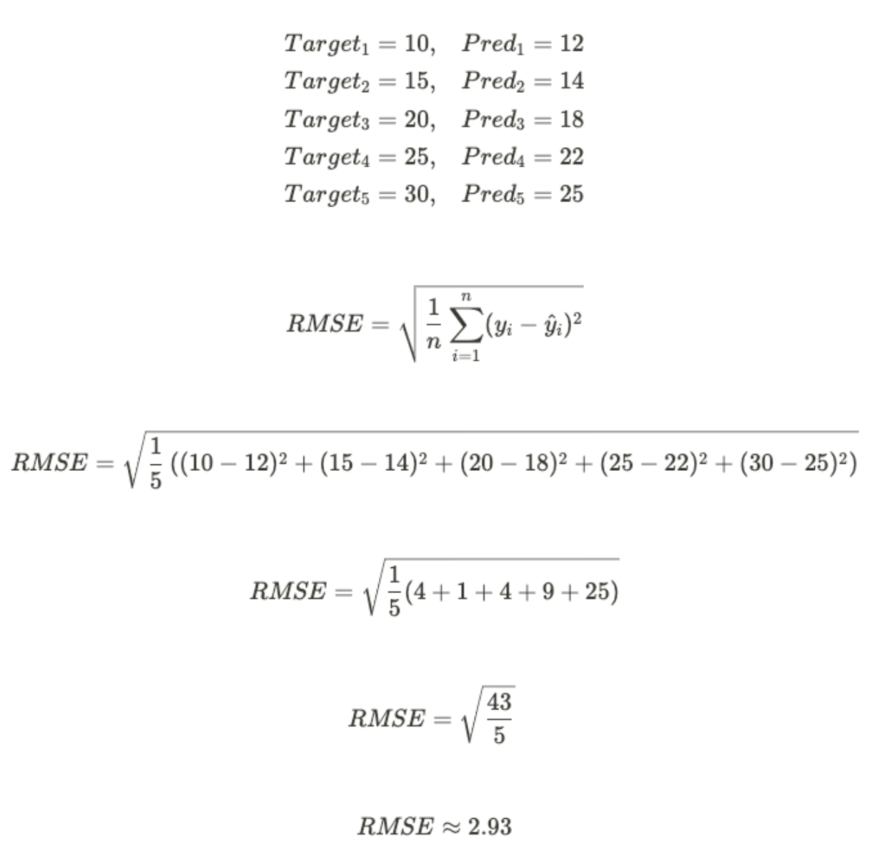
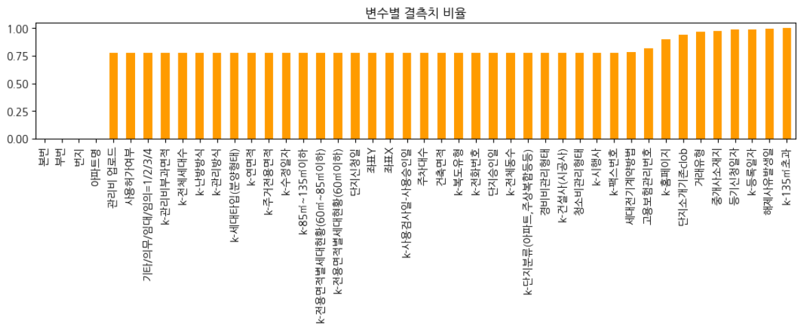
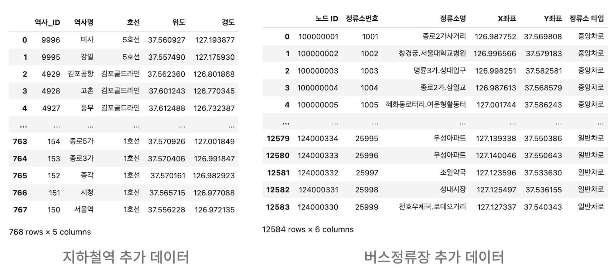
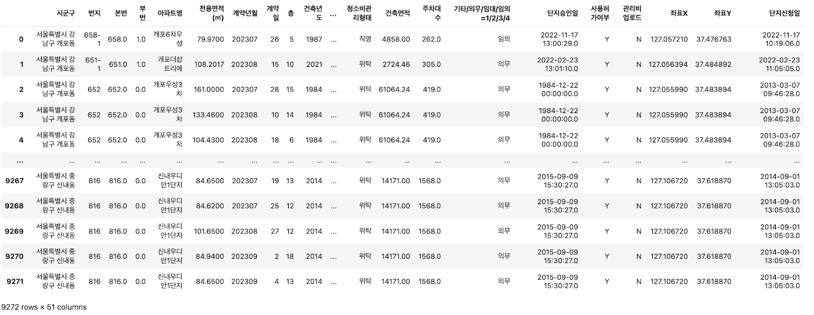
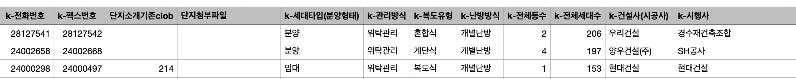
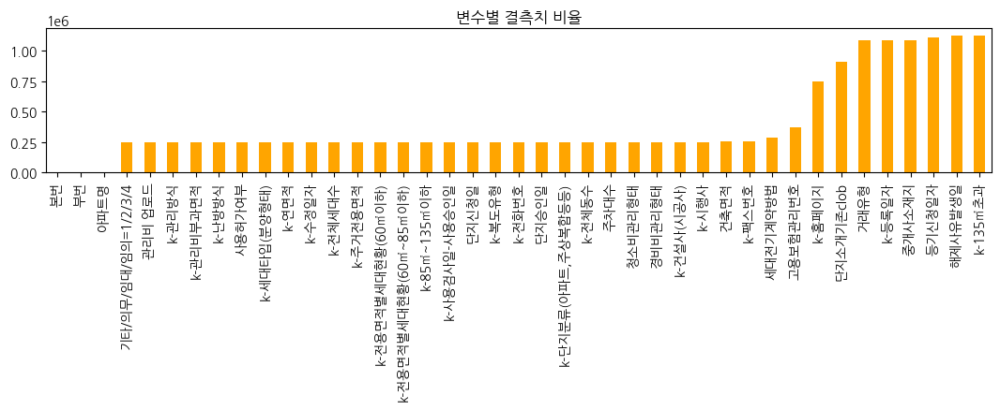
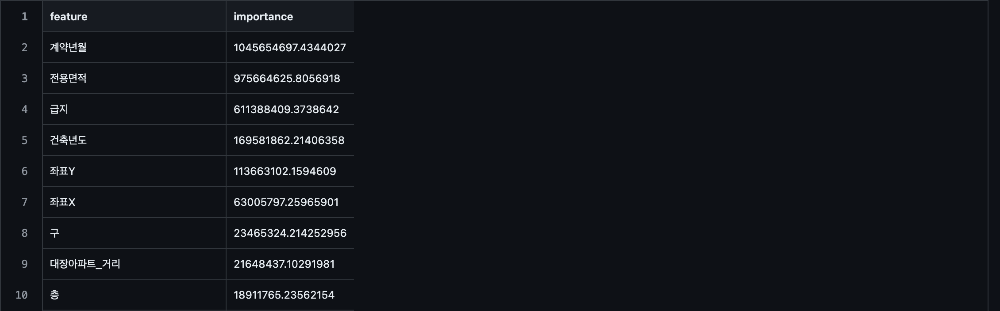
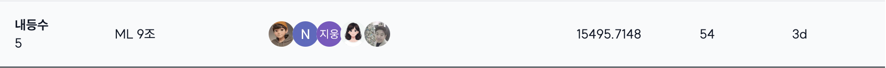
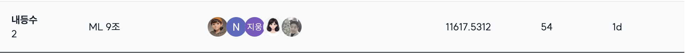

# Upstage AI Lab 3기 Regression 대회

## Team - 클라우드 9 (행복의 절정)

|  |  |  |  |  |
| :--------------------------------------------------------------: | :--------------------------------------------------------------: | :--------------------------------------------------------------: | :--------------------------------------------------------------: | :--------------------------------------------------------------: |
|            [조용중(팀장)](https://github.com/UpstageAILab)             |            [김나리](https://github.com/UpstageAILab)             |            [최윤설](https://github.com/developzest)             |            [한지웅](https://github.com/UpstageAILab)             |            [남상이](https://github.com/UpstageAILab)             |
|전반적인 의견조율, 전처리와 모델링의 기초코드 제공, 발표 |데이터 결측치 처리, catboost 모델링, 발표자료 |데이터 전처리, EDA, 모델링, 발표자료 | EDA, 모델링 |                                                           
|                                                                    |

## 1. Competiton Info

### Overview

- House Price Prediction 경진대회는 주어진 데이터를 활용하여 서울의 아파트 실거래가를 효과적으로 예측하는 모델을 개발하는 대회입니다.

### Timeline
- 2024년 7월 09일 (화) ~ 7월 14일 (월) - 온라인 수업, 각자 데이터 EDA
- 2024년 7월 15일 (월) - 회의 후, 회의 결과를 바탕으로 데이터 전처리
- 2024년 7월 16일 (월) - 각자 EDA 및 Feature Engineering
- 2024년 7월 17일 (수) - 최종 데이터셋 설정 및 Modeling
- 2024년 7월 18일 (목) - Feature Selection 및 Modeling Hyper-parameter tuning
- 2024년 7월 19일 (금) - 최고 성능 모델 추가 처리 및 최종 제출 기한

### Evaluation

- 아파트 매매의 맥락에서는 회귀 모델이 실제 거래 가격의 차이를 얼마나 잘 잡아내는지 측정
    

## 2. Components

### Directory

- _Insert your directory structure_

## 3. Data descrption

### Dataset overview

1. 학습 데이터
    - 주요 데이터는 .csv 형태로 제공되며, 서울시 아파트의 각 시점에서의 거래금액(만원)을 예측하는 것이 목표
    - 학습 데이터는 아래와 같이 1,118,822개이며, 예측해야 할 거래금액(target)을 포함한 52개의 아파트의 정보에 대한 변수와 거래시점에 대한 변수가 주어짐
    - 학습 데이터의 기간은 2007년 1월 1일부터 2023년 6월 30일까지이며, 각 변수 명이 한글로 되어있어 어떤 정보를 나타내는 변수인지 쉽게 확인 가능
        - 예시)
            - 시군구 : “서울특별시 강남구 개포동” 과 같이 주소에 대한 정보
            - 아파트명 : “개포더샵트리에”와 같이 아파트명에 대한 정보
            - 전용면적(㎡) : “108.2017”와 같이 매매대상의 전용면적에 대한 정보
            - 건축년도 : “2021”과 같이 아파트의 건축 연도를 나타내는 정보
    - 각 변수가 갖는 결측치 비율
        
    - 아파트의 매매가를 결정하는데에 교통적인 요소가 영향을 줄 수 있기에 추가 데이터로 서울시 지하철역, 서울시 버스정류장의 정보가 주어짐
        - 추가 데이터는 위도와 경도, 좌표 X와 좌표Y와 같이 거리에 대한 정보가 포함되어 있으며, 이를 활용하여 학습 데이터와 함께 사용 가능
        
2. 평가 데이터
    - .csv 형태로 제공되며 학습데이터와 같이 예측해야 할 거래금액(target)을 제외하고 51개의 거래 대상이 되는 아파트의 정보에 대한 변수와 거래시점에 대한 변수가 주어짐
    - 학습 데이터의 기간은 2007년 1월 1일부터 2023년 6월 30일까지이고, 평가 데이터는 학습 데이터기간 이후 3개월인 2023년 7월 1일부터 2023년 9월 26일까지의 정보로 구성
    - 학습 데이터는 1,118,822인 반면, 평가 데이터는 총 9272개이며 대략적인 구조는 아래와 동일
        

### EDA

- EDA 자동화 도구인 Dataprep.eda & ydata_profiling 사용
    - matplotlib, seaborn 등 기존 시각화 패키지를 사용하여 세밀한 확인 추가 진행
    - 각 feature 데이터의 분포 확인

- 데이터 특징 확인
     - 학습 데이터와 평가 데이터의 공통적인 특징  
         - 결측치가 70%가 넘는 feature들이 데이터의 대부분을 차지함.
         - 타 컬럼 대비 '번지', '본번', '부번', '아파트명' 의 경우 결측률이 대략 0.2% 이내임을 파악
            - 주어진 데이터셋의 '번지' 데이터 값이 '본번'-'부번' 으로 구성됨 확인
         - '도로명', '등기신청일자', '거래유형', '중개사소재지' 에 실제 결측치라고 표시되지 않았으나 아무 의미 없는 값들을 포함하여 이를 결측치로 인식할 수 있도록 변경
         - '시군구', '도로명', '번지'로 아파트의 특징을 활용가능.
         - '층'에 음수값이 포함됨 확인
     - 학습 데이터의 특징
         - '전용면적'에 대한 가격에서 이상치들이 존재. (ex 같은 강남구에서 160평대 아파트 평균값이 130평대 아파트의 그것보다 낮음 )
     - 평가 데이터의 특징
         - '거래유형' 항목의 결측치가 없음 (학습데이터는 75프로가 결측치)

### Feature engineering

1. 결측치 처리
     - '서울시 공동주택 아파트 정보.csv'파일을 확보 (출처 : [서울 열린데이터 광장](https://data.seoul.go.kr/dataList/OA-15818/S/1/datasetView.do))
         - 우리의 데이터와 일치하는 정보의 이름이 상당수 포함
            
         - 도로명 기준으로 merge 한 결과 결측치가 25프로 정도로 확 줄어듬
     - 좌표 결측치 
         - 가까운 지하철역의 거리를 계산하는데 가장 필요한 정보이므로, 선형보간하는 건 옳지 않다고 판단하여 최대한 결측치를 줄이려고 노력
         - 1차 전처리 : '아파트명'을 기준으로 공백 '도로명' 보완
         - 2차 전처리 : '시군구'와 '도로명'을 기준으로 카카오 API를 활용 -> 결측치가 20프로로 줄어듬
         - 3차 전처리 : 좌표를 못찾은 데이터의 중복을 제거한 후 남은 90여개의 도로명에 대해 (시군구 + 번지) 주소를 이용하여 검색 후 직접 채워넣음 -> 결측치 없음
            
     - '번지'의 경우, 2개의 아파트에 대한 값을 찾아서 대체 

2. 파생변수
     - '구', '동', '계약연도', '계약월' : 기존의 시군구와 계약년월를 가공한 정보들
     - 시공능력평가_상위여부
         - k-건설사(시공사)의 데이터를 정제하여 시공능력평가 20위 안에 드는 시공사에는 1 값을, 그렇지 않으면 0값을 부여힘
     - 대장아파트_거리
         - 구별 대장아파트를 확인 후 그것들의 좌표를 이용하여 각 아파트와 대장아파트간의 거리를 구함
     - distance_score  
         - 지하쳘역의 위도경도 좌표와 학습 데이터의 좌표를 이용하여 가장 가까운 지하철역을 찾고, 아파트와 지하철 사이의 거리에 따라서 가까운 것은 10점 먼 것은 0점을 기준으로 하여 점수를 부여함
     - subway_count
         - 아파트의 반경 1km안에 존재하는 지하철역 갯수 카운팅
     - '급지'
         - '평단가'(전용면적 대비 실거래가)를 '동'과 '계약연도'별 그룹화 후 평균을 구한 Z-score를 기반으로 범주형 데이터로 변환한 변수 추가
     - 신축여부 
         - 2009년 이후에 지어졌으면 비교적 신축이라고 판단
     - 이자율
         - 아파트를 매매할때과 관련이 큰 주택담보대출 이율을 월별로 저장한 데이터를 이용 (출처 : [한국은행경제통계시스템](https://ecos.bok.or.kr/#/SearchStat))

3. 이상치 처리
    - '층'의 음수값을 1로 대체

## 4. Modeling
### Simple Model

LightGBM의 경우, 대용량 데이터셋에 대해 빠르게 훈련이 가능하며 결측값을 포함한 데이터를 알아서 처리하고
CatBoost의 경우, 범주형 데이터를 자동으로 처리하는 특징이 있어 두 모델을 사용.

 - LightGBM
     - wandb와 연동하여 모니터링 하면서 모델을 최적화 
 - CatBoost
     - gpu를 사용
     - optuna를 짧게 여러번 이용하면서 하이퍼파라미터 최적화
 - Processing
     - LGBM을 이용하여 feature importance를 계산 (feature_impotances.csv)
      
     - feature importance가 높은 순으로 계산에 들어갈 feature들을 자동으로 선택한 후 모델에 적용한 rmse 결과를 비교 -> 가장 이상적인 feature의 갯수 설정
     - 여러가지 k-fold들 (K-Fold, TimeSeriesSplit, Random seed KFold 등) 을 적용
     - LGBM 과 CatBoost 결과를 앙상블
     - [Wandb으로 보는 LGBM의 다양한 결과들](https://wandb.ai/ml9_regression/re_price_prediction/reports/9---Vmlldzo4NzM2MTM2?accessToken=hz8avuctz0w1z3rgfhml93v9achc4jgusy7sqyp7bg9g4rs3lum3ievzc3lffaky)

### Meta model
 - 기준이 되는 feature에 대한 $1m^2$당 평균가격을 바탕으로 급지를 나누고 나눈 급지별로 모델을 fit한 후 결과 합침
     - '동', '도로명' 두가지의 경우로 나누어 실행
 - 전용면적이 큰 곳의 가격에서의 에러가 높음을 인지하고, 60평을 기준으로 데이트를 나누어 모델을 fit한 후, 결과들을 합친 후, Ridge와 같은 선형회귀모델로 결과값을 다시 계산   

## 5. Result
- 위와 같이 여러가지 방법을 시도 했으나, 결과가 가장 좋았던 것은 Simple LightGBM에서 하이퍼파라미터를 튜닝한 모델

- Validation data의 rmse값이 5500~5600대일때 public에서 좋은 결과를 확인
  
- public에서 가장 낮은 rmse값을 가지는 것은 ???? 후 LightGBM + Hyperparam 모델로 계산한 결과값

- private에서 가장 낮은 rmse값을 가지는 것은 위에서의 데이터 전처리를 마친 후, LightGBM + Hyperparam 모델로 계산한 결과값 

- 그리고 대체로 LGBM과 CAT의 결과를 앙상블 한 결과였음.

- meta model은 설계는 해뒀으나 너무 늦게 아이디어를 생각하게 되어 리더보드에 올려보지 못함

### Leader Board
- public 5위

- private 2위

## etc

### Meeting Log

- _Insert your meeting log link like Notion or Google Docs_

### Reference

- _Insert related reference_
