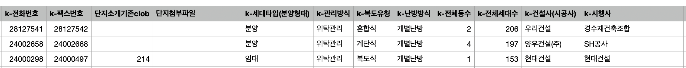
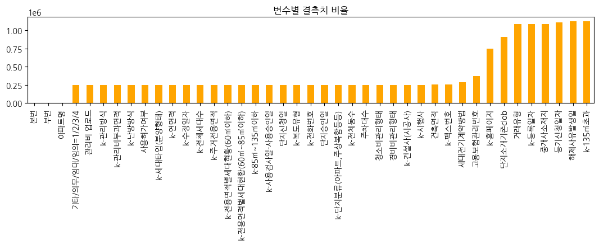

# Upstage AI Lab 3기 Regression 대회
## 9조: Team 클라우드 9 (행복의 절정)

---

## 팀원 소개

|  |  |  |  |  |
| :--------------------------------------------------------------: | :--------------------------------------------------------------: | :--------------------------------------------------------------: | :--------------------------------------------------------------: | :--------------------------------------------------------------: |
|            [조용중(팀장)](https://github.com/UpstageAILab)             |            [김나리](https://github.com/UpstageAILab)             |            [최윤설](https://github.com/developzest)             |            [한지웅](https://github.com/wooong1223)             |            [남상이](https://github.com/UpstageAILab)             |
|전반적인 의견조율, 전처리와 모델링의 기초코드 제공, 발표 |데이터 결측치 처리, catboost 모델링, 발표자료 |데이터 전처리, EDA, 모델링, 발표자료 |EDA, 기타 모델링 | EDA, 모델링|                                                          

---

## 1. 대회 개요

- **목표**: 서울의 아파트 실거래가 예측 모델 개발
- **평가 지표**: RMSE (Root Mean Squared Error)
- **기간**: 2024년 7월 09일 ~ 7월 19일

### Timeline
- 2024년 7월 09일 (화) ~ 7월 14일 (월) - 온라인 수업, 각자 데이터 EDA
- 2024년 7월 15일 (월) - 회의 후, 회의 결과를 바탕으로 데이터 전처리
- 2024년 7월 16일 (월) - 각자 EDA 및 Feature Engineering
- 2024년 7월 17일 (수) - 최종 데이터셋 설정 및 Modeling
- 2024년 7월 18일 (목) - Feature Selection 및 Modeling

 ### **Hyper-parameter tuning**
- 2024년 7월 19일 (금) - 최고 성능 모델 추가 처리 및 최종 제출 기한

---

## 2. 데이터 설명
 

### 학습 데이터
- 1,118,822개 샘플, 52개 변수
- 기간: 2007년 1월 1일 ~ 2023년 6월 30일
- 주요 변수: 시군구, 아파트명, 전용면적, 건축년도 등

 

### 평가 데이터
- 9,272개 샘플, 51개 변수 (타겟 변수 제외)
- 기간: 2023년 7월 1일 ~ 2023년 9월 26일

---

## 3. EDA 및 전처리
 

### 주요 발견사항
- 70% 이상의 결측치를 가진 특성들이 다수
- '번지', '본번', '부번', '아파트명'의 결측률은 0.2% 이내
- '전용면적'에 따른 가격에서 이상치 존재
 
### 전처리 과정
1. 결측치 처리
   - 서울시 공동주택 아파트 정보 활용
   - 카카오 API를 이용한 좌표 정보 보완
2. 파생변수 생성
   - 지리적 정보, 시공사 정보, 거리 점수 등
3. 이상치 처리
   - '층'의 음수값을 1로 대체

---
### Feature engineering

1. 결측치 처리
     - '서울시 공동주택 아파트 정보.csv'파일을 확보 (출처 : [서울 열린데이터 광장](https://data.seoul.go.kr/dataList/OA-15818/S/1/datasetView.do))
         - 우리의 데이터와 일치하는 정보의 이름이 상당수 포함
         
         - 도로명 기준으로 merge 한 결과 결측치가 25프로 정도로 확 줄어듬
  ---
   - 좌표 결측치 
         - 가까운 지하철역의 거리를 계산하는데 가장 필요한 정보이므로, 선형보간하는 건 옳지 않다고 판단하여 최대한 결측치를 줄이려고 노력
         - 1차 전처리 : '아파트명'을 기준으로 공백 '도로명' 보완
         - 2차 전처리 : '시군구'와 '도로명'을 기준으로 카카오 API를 활용 -> 결측치가 20프로로 줄어듬
         - 3차 전처리 : 좌표를 못찾은 데이터의 중복을 제거한 후 남은 90여개의 도로명에 대해 (시군구 + 번지) 주소를 이용하여 검색 후 직접 채워넣음 -> 결측치 없음
            
     - '번지'의 경우, 2개의 아파트에 대한 값을 찾아서 대체 
---
### 파생변수
   - '구', '동', '계약연도', '계약월' : 기존의 시군구와 계약년월를 가공한 정보들
   - 시공능력평가_상위여부
   - k-건설사(시공사)의 데이터를 정제하여 시공능력평가 20위 안에 드는 시공사에는 1 값을, 그렇지 않으면 0값을 부여힘
   - 대장아파트_거리
         - 구별 대장아파트를 확인 후 그것들의 좌표를 이용하여 각 아파트와 대장아파트간의 거리를 구함
   - distance_score  
         - 지하쳘역의 위도경도 좌표와 학습 데이터의 좌표를 이용하여 가장 가까운 지하철역을 찾고, 아파트와 지하철 사이의 거리에 따라서 가까운 것은 10점 먼 것은 0점을 기준으로 하여 점수를 부여함
   - subway_count
         - 아파트의 반경 1km안에 존재하는 지하철역 갯수 카운팅
   - '급지'
         - '평단가'(전용면적 대비 실거래가)를 '동'과 '계약연도'별 그룹화 후 평균을 구한 Z-score를 기반으로 범주형 데이터로 변환한 변수 추가
   - 신축여부 
         - 2009년 이후에 지어졌으면 비교적 신축이라고 판단
   - 이자율
         - 아파트를 매매할때과 관련이 큰 주택담보대출 이율을 월별로 저장한 데이터를 이용 (출처 : [한국은행경제통계시스템](https://ecos.bok.or.kr/#/SearchStat))

### 이상치 처리
   - '층'의 음수값을 1로 대체

---

## 4. 모델링

### 사용 모델
- RandomForest
- XGBoost
- LightGBM (결정모델)
- CatBoost (앙상블 모델)
 
### 주요 기법
- Feature Importance를 이용한 변수 선택
- K-Fold 교차 검증
- 하이퍼파라미터 최적화 (wandb, optuna)
- 앙상블 기법

- [Wandb 결과](https://wandb.ai/ml9_regression/re_price_prediction/reports/9---Vmlldzo4NzM2MTM2?accessToken=hz8avuctz0w1z3rgfhml93v9achc4jgusy7sqyp7bg9g4rs3lum3ievzc3lffaky)
---

## 5. 결과
 

### 최종 모델
- LightGBM + 하이퍼파라미터 최적화
- LightGBM + catBoost 앙상블 모델
  
### 리더보드 순위
- Public: 5위
- Private: 2위

---

## 6. 결론 및 향후 계획
- 위와 같이 여러가지 방법을 시도 했으나, 결과가 가장 좋았던 것은 Simple LightGBM에서 하이퍼파라미터를 튜닝한 모델
- Validation data의 rmse값이 5500~5600대일때 public에서 좋은 결과를 확인
- public에서 가장 낮은 rmse값을 가지는 것은 LightGBM + Hyperparam 모델로 계산한 결과
- private에서 가장 낮은 rmse값을 가지는 것은 위에서의 데이터 전처리를 마친 후, LightGBM + Hyperparam 모델로 계산한 결과값 
- 그리고 대체로 LGBM과 CAT의 결과를 앙상블 한 결과였음.
- meta model은 설계는 해뒀으나 너무 늦게 아이디어를 생각하게 되어 리더보드에 올려보지 못함

- 단순 모델이 더 좋은 성능을 보임
- 메타 모델 등 추가 실험 필요
- 특성 공학에 더 집중할 필요성 확인

---

## 참고 자료

- [서울 열린데이터 광장](https://data.seoul.go.kr/dataList/OA-15818/S/1/datasetView.do)
- [한국은행경제통계시스템](https://ecos.bok.or.kr/#/SearchStat)
- [Wandb 결과](https://wandb.ai/ml9_regression/re_price_prediction/reports/9---Vmlldzo4NzM2MTM2?accessToken=hz8avuctz0w1z3rgfhml93v9achc4jgusy7sqyp7bg9g4rs3lum3ievzc3lffaky)